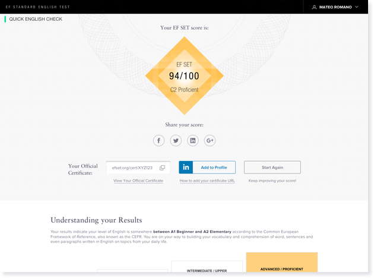
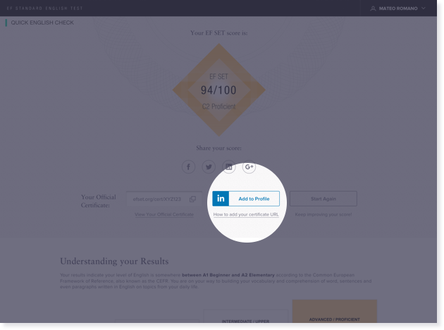
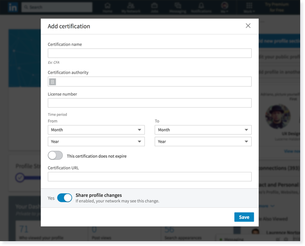
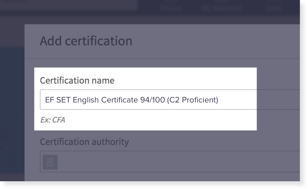

{}

{}
{}

Certification helps you set yourself apart from other applicants and increases your profile or CV’s visibility. In fact, LinkedIn has confirmed that you can boost you profile views up to 6x by adding your certified skills.

Once you're ready to showcase your EF SET English certificate, follow our step-by-step guide for how to add your EF SET Certificate™ to your LinkedIn profile.

**Step 1: Take the EF SET**
The LinkedIn Add-to-Profile option is only available with completion of the 50-minute EF SET™ or the 120-minute EF SET Plus™.

**Step 2: Click on “Add-to-Profile” button from the EF SET Results Page**

You may be prompted to sign in to LinkedIn or to create an account, if you do not already have one.

Once in LinkedIn, you will be shown the Add-to-Profile form.

**Step 3: Fill out the form**
In the "Certification name" field, enter the test name, score out of 100 and your CEFR level and descriptor.
All of these details can be found on your unique Certificate URL. For example: EF SET English Certificate 94/100 (C2 Proficient)

{}
{}

{}
